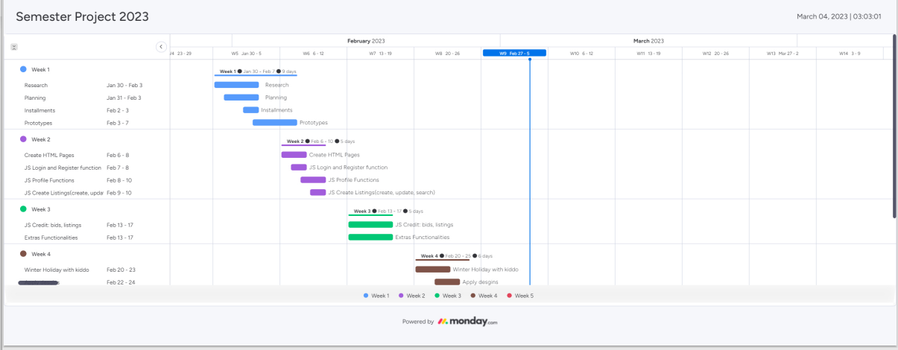

# KennTorg SP2 Auction_House

**This is Semester Project 2 Auction created with Noroff Api**

##

**Pages**

- [✓] Home
- [✓] Profile
- [✓] Single listing
- [✓] Login
- [✓] Register

**Functionality**

- [✓] Register
- [✓] Login
- [✓] Logout
- [✓] Change avatar
- [✓] View credit
- [✓] Create listing
- [✓] Place bid
- [✓] View bids made
- [✓] View users bids
- [✓] User may credit to bid
- [✓] View Single listing
- [✓] Unregistered user can browse, search and view listings

**Design**

- [✓] Responsive
- [✓] WCAG
- [✓] Fonts

**Hosting**

- [✓] Netlify

### Walkthrough

- This app is built with:

 

- This is a project for Noroff school of technology. The information is given from the Noroff
  Auction API.

- This is and application for the targetted audience "**everyone**" to sell and bid on items. The user can register an @noroff.com/@stud.noroff.com adresses. Log in, storing the access token in localStorage. When user logs out the localStorage token is deleted.
  If the user is not logged in they can browse the listings and search for listings on the homepage. But they wont be able to bid on listings or see profile.

- A logged in user may see their own profile page where they can change profile picture, see their username, display their bids, listings and their total credit.

- This projet were focused on being userfriendly and easy to navigate and have working functions rather than design. The application were designed to easely could change colors or add backgrounds. But chose to stick with the modern look, the Apple feels...

### Links

<table>
  <thead>
    <tr>
      <th>Resource</th>
      <td>URL</td>
    </tr>
  </thead>
  <tbody>
    <tr>
      <th>Gantt Chart</th>
         <td><a href="https://tg123-force.monday.com/boards/1149983381/views/1682294">Gantt Chart URL</a></td>
    </tr>
    <tr>
      <th>Design Prototype</th>
      <td><a href="https://xd.adobe.com/view/238a9b7b-a00b-4c92-9972-2182add8e75e-76d9/">Web Prototype</a>  
      <a href="https://xd.adobe.com/view/9abb0f4a-ed64-4faa-b2b2-30a404e896a5-cfe8/">Mobile Prototype</a></td>
    </tr>
    <tr>
      <th>Style Guide</th>
      <td><a href="https://xd.adobe.com/view/bc482d20-ff5f-4120-9ce9-6b27a6912491-e91b/">Style Guide</a></td>
    </tr>
    <tr>
      <th>Kanban Board</th>
      <td><a href="https://github.com/users/KennTorg/projects/3">Project Board Link</a></td>
    </tr>
    <tr>
      <th>Repository</th>
      <td><a href="https://github.com/KennTorg/Auction_House">Github Project Repository</a></td>
    </tr>
    <tr>
      <th>Hosted Demo</th>
      <td><a href="https://sp2-auction.netlify.app/">Netlify Link</a></td>
    </tr>
    <tr>
    <th>Hotjar Tests</th>
    <td><a href="https://hotjar.com/l/JmoeZd">Hotjar Link</a></td>
    </tr>
  </tbody>
</table>

### Images for restricted links

